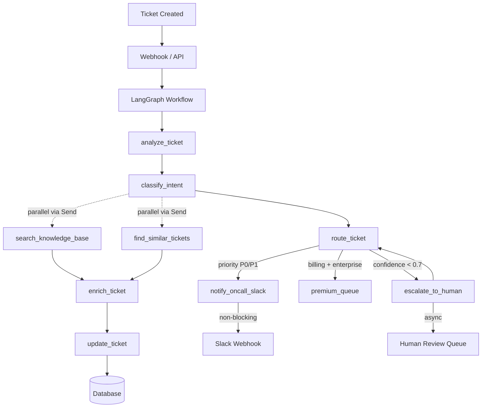

# AI Support Ticket Triager - Integration Guide

Integrating LangGraph workflows into an existing support ticket system.

---

## Architecture Overview



---

## LangGraph Workflow Design

### Node Definitions

| Node | Responsibility |
|------|---------------|
| `analyze_ticket` | Extract subject, urgency signals, customer tier |
| `classify_intent` | Categorize as Billing, Technical, Account, or Feature Request |
| `route_ticket` | Determine team, priority, and escalation flags |
| `enrich_ticket` | Add knowledge base links, similar tickets, SLA info |
| `update_ticket` | Write routing decision back to your database |

### Conditional Routing Rules

```
confidence < 0.7    ──▶  escalate_to_human()
priority == P0/P1   ──▶  notify_oncall_slack()      [parallel, non-blocking]
intent == billing   ──▶  route_to_premium_queue()  [if enterprise tier]
```

### Advanced Features

| Feature | Implementation |
|---------|----------------|
| Parallel Execution | `Send` API for concurrent KB search + similar ticket lookup |
| Checkpointing | `MemorySaver` for stateful resumption |
| Streaming | `graph.stream()` with token-by-token output |
| Error Boundaries | Retry middleware + fallback nodes |
| Observability | LangSmith tracing + OpenTelemetry |

---

## Integration Points

| Your System | LangGraph Integration |
|-------------|----------------------|
| Ticket Created Event | Webhook triggers `graph.run(ticket_id)` |
| Team/Queue Database | Tools for reading/writing routing decisions |
| Customer Data | Tool to fetch customer tier, history |
| Knowledge Base | Tool to search KB for related articles |
| Slack/Email | Tool to send notifications |
| Feedback Mechanism | Human corrections stored as training data |

## Parallel Execution with Send API

LangGraph's `Send` API enables running multiple nodes concurrently, ideal for enrichment operations that don't depend on each other.

```python
# agent/nodes.py
from langgraph.constants import Send
from .state import TriageState

def classify_intent(state: TriageState) -> list[Send]:
    """
    Returns a list of Send objects to run search_knowledge_base
    and find_similar_tickets in parallel.
    """
    return [
        Send("search_knowledge_base", {
            "query": f"{state.subject} {state.body[:200]}",
            "ticket_id": state.ticket_id,
        }),
        Send("find_similar_tickets", {
            "subject": state.subject,
            "ticket_id": state.ticket_id,
        }),
    ]

def search_knowledge_base(state: TriageState) -> TriageState:
    """Node: Search KB for related articles."""
    from .tools import search_knowledge_base as kb_search

    kb_articles = kb_search.invoke({"query": state.query})
    return state.model_copy(update={
        "kb_links": [a["url"] for a in kb_articles],
    })

def find_similar_tickets(state: TriageState) -> TriageState:
    """Node: Find open tickets with similar subjects."""
    from .tools import find_similar_tickets as find_tickets

    similar_tickets = find_tickets.invoke({
        "subject": state.subject,
        "ticket_id": state.ticket_id,
    })
    return state.model_copy(update={
        "similar_ticket_ids": similar_tickets,
    })
```

### Graph with Parallel Edges

```python
# agent/graph.py
from langgraph.graph import StateGraph, END
from langgraph.constants import Send
from .state import TriageState
from .nodes import (
    analyze_ticket,
    classify_intent,
    route_ticket,
    search_knowledge_base,
    find_similar_tickets,
    enrich_ticket,
    process_ticket,
    handle_escalation,
    notify_oncall,
)

def build_triage_graph():
    graph = StateGraph(TriageState)

    # Add all nodes
    graph.add_node("analyze", analyze_ticket)
    graph.add_node("route", route_ticket)
    graph.add_node("enrich", enrich_ticket)
    graph.add_node("process", process_ticket)
    graph.add_node("escalate", handle_escalation)
    graph.add_node("notify_oncall", notify_oncall)
    graph.add_node("search_knowledge_base", search_knowledge_base)
    graph.add_node("find_similar_tickets", find_similar_tickets)

    graph.set_entry_point("analyze")
    graph.add_edge("analyze", "route")
    graph.add_edge("route", "classify_intent")

    # Parallel execution via Send
    graph.add_conditional_edges(
        "classify_intent",
        classify_intent,
        ["search_knowledge_base", "find_similar_tickets"]
    )

    # Both parallel nodes converge to enrich
    graph.add_edge("search_knowledge_base", "enrich")
    graph.add_edge("find_similar_tickets", "enrich")
    graph.add_edge("enrich", "process")
    graph.add_edge("process", END)

    return graph.compile()
```

### Conditional Routing with Multiple Branches

```python
def route_ticket(state: TriageState) -> str:
    """
    Multi-branch routing:
    - P0/P1 priority → notify oncall immediately (parallel, non-blocking)
    - Low confidence → escalate to human review
    - Enterprise + billing → premium queue
    """
    if state.priority in [Priority.P0, Priority.P1]:
        return "notify_oncall"
    elif state.needs_escalation:
        return "escalate"
    elif state.intent == Intent.BILLING and state.customer_tier == "enterprise":
        return "premium_queue"
    return "classify_intent"
```

---

## Features to Add

### 1. Auto-Triage
Automatically route incoming tickets to the correct team based on intent classification.

### 2. Priority Detection
Flag P0/P1 tickets for immediate attention and page on-call staff.

### 3. Escalation Detection
Identify ambiguous or high-stakes tickets that require human review.

### 4. Auto-Reply Draft
Generate a suggested first response based on ticket content and knowledge base.

### 5. Link Similar Tickets
Find related open tickets to prevent duplicate work and help agents.

### 6. SLA Risk Scoring
Predict which tickets are at risk of breaching SLA based on queue depth and priority.

---

## Implementation: Auto-Triage Workflow

### Project Structure

```
support-triage/
├── agent/
│   ├── __init__.py
│   ├── state.py          # Typed state + schema
│   ├── nodes.py          # Graph nodes
│   ├── tools.py          # Tool definitions
│   ├── graph.py          # Graph construction
│   └── models.py         # Pydantic models
├── api/
│   └── webhooks.py       # FastAPI webhook endpoint
├── tests/
│   └── test_triage.py
└── pyproject.toml
```

### 1. State Definition

```python
# agent/state.py
from typing import Optional
from pydantic import BaseModel
from enum import Enum

class Intent(Enum):
    BILLING = "billing"
    TECHNICAL = "technical"
    ACCOUNT = "account"
    FEATURE_REQUEST = "feature_request"
    UNKNOWN = "unknown"

class Priority(Enum):
    P0 = "p0"  # Critical - immediate response
    P1 = "p1"  # High - within 4 hours
    P2 = "p2"  # Medium - within 24 hours
    P3 = "p3"  # Low - within 48 hours

class Team(Enum):
    BILLING_TEAM = "billing_team"
    TECHNICAL_TEAM = "technical_team"
    ACCOUNT_TEAM = "account_team"
    PRODUCT_TEAM = "product_team"
    PREMIUM_QUEUE = "premium_queue"  # Enterprise billing

class TriageState(BaseModel):
    ticket_id: str
    subject: str
    body: str
    customer_id: str
    customer_tier: str = "free"  # free, pro, enterprise

    # Analysis results (populated by nodes)
    intent: Optional[Intent] = None
    priority: Optional[Priority] = None
    team: Optional[Team] = None
    confidence: float = 0.0
    reasoning: Optional[str] = None

    # Flags
    needs_escalation: bool = False
    escalation_reason: Optional[str] = None

    # Enrichment
    kb_links: list[str] = []
    similar_ticket_ids: list[str] = []
    suggested_reply: Optional[str] = None

    # Error handling
    error: Optional[str] = None
```

### 2. Tool Definitions

```python
# agent/tools.py
from langchain_core.tools import tool
from typing import Optional
import httpx

@tool
def get_customer(customer_id: str) -> dict:
    """Fetch customer details from your system."""
    # Replace with your actual API call
    response = httpx.get(f"https://your-api.com/customers/{customer_id}")
    return response.json()

@tool
def get_ticket(ticket_id: str) -> dict:
    """Fetch ticket details from your system."""
    response = httpx.get(f"https://your-api.com/tickets/{ticket_id}")
    return response.json()

@tool
def update_ticket(
    ticket_id: str,
    team: str,
    priority: str,
    intent: str,
    confidence: float,
    kb_links: list[str] = [],
    similar_ticket_ids: list[str] = [],
) -> dict:
    """Update ticket with triage decisions."""
    response = httpx.patch(
        f"https://your-api.com/tickets/{ticket_id}",
        json={
            "team": team,
            "priority": priority,
            "intent": intent,
            "triage_confidence": confidence,
            "kb_links": kb_links,
            "similar_ticket_ids": similar_ticket_ids,
            "triage_status": "completed",
        }
    )
    return response.json()

@tool
def search_knowledge_base(query: str) -> list[dict]:
    """Search internal knowledge base for related articles."""
    response = httpx.post(
        "https://your-api.com/kb/search",
        json={"query": query, "limit": 3}
    )
    return response.json().get("articles", [])

@tool
def find_similar_tickets(subject: str, ticket_id: str) -> list[str]:
    """Find open tickets with similar subjects."""
    response = httpx.post(
        "https://your-api.com/tickets/similar",
        json={"subject": subject, "exclude_id": ticket_id, "status": "open"}
    )
    return response.json().get("ticket_ids", [])

@tool
def notify_slack(channel: str, message: str) -> dict:
    """Send notification to Slack channel."""
    response = httpx.post(
        "https://slack-webhook-url.com",
        json={"channel": channel, "text": message}
    )
    return response.json()

@tool
def create_feedback_log(
    ticket_id: str,
    predicted_intent: str,
    corrected_intent: Optional[str] = None,
    corrected_team: Optional[str] = None,
) -> dict:
    """Log human corrections for model improvement."""
    response = httpx.post(
        "https://your-api.com/feedback",
        json={
            "ticket_id": ticket_id,
            "predicted_intent": predicted_intent,
            "corrected_intent": corrected_intent,
            "corrected_team": corrected_team,
            "feedback_source": "triage_review",
        }
    )
    return response.json()
```

### 3. Graph Nodes

```python
# agent/nodes.py
from .state import TriageState, Intent, Priority, Team
from .tools import (
    get_customer,
    search_knowledge_base,
    find_similar_tickets,
    update_ticket,
    notify_slack,
)
import httpx

def analyze_ticket(state: TriageState) -> TriageState:
    """
    Node 1: Analyze ticket content and customer context.
    Extracts urgency signals and enriched customer info.
    """
    # Fetch customer data
    customer = get_customer.invoke({"customer_id": state.customer_id})

    # Build analysis prompt
    prompt = f"""
    Analyze this support ticket:

    Subject: {state.subject}
    Body: {state.body}
    Customer Tier: {customer.get('tier', 'unknown')}

    Identify:
    1. Urgency signals (keywords like 'urgent', 'broken', 'down', 'ASAP')
    2. Customer sentiment (frustrated, angry, neutral, patient)
    3. Any SLA-relevant context

    Return a JSON with: urgency_score (0-1), sentiment, key_phrases[]
    """

    # Call LLM (replace with your actual LLM call)
    # response = llm.invoke(prompt)
    response = {"urgency_score": 0.5, "sentiment": "neutral", "key_phrases": []}

    # Update state with analysis
    return state.model_copy(update={
        "customer_tier": customer.get("tier", "free"),
    })

def classify_intent(state: TriageState) -> TriageState:
    """
    Node 2: Classify ticket intent using LLM.
    """
    prompt = f"""
    Classify this ticket into ONE of these categories:
    - billing: Payment, subscription, invoice, refund issues
    - technical: Bugs, errors, integration issues, API problems
    - account: Login issues, password reset, profile updates, permissions
    - feature_request: New features, improvements, suggestions

    Subject: {state.subject}
    Body: {state.body}

    Return JSON with: intent, confidence (0-1), reasoning
    """

    # response = llm.invoke(prompt)
    response = {
        "intent": "technical",
        "confidence": 0.85,
        "reasoning": "Keywords indicate API integration issue"
    }

    return state.model_copy(update={
        "intent": Intent(response["intent"]),
        "confidence": response["confidence"],
        "reasoning": response["reasoning"],
    })

def route_ticket(state: TriageState) -> TriageState:
    """
    Node 3: Route ticket to appropriate team with priority.
    """
    # Map intent -> default team
    intent_team_map = {
        Intent.BILLING: Team.BILLING_TEAM,
        Intent.TECHNICAL: Team.TECHNICAL_TEAM,
        Intent.ACCOUNT: Team.ACCOUNT_TEAM,
        Intent.FEATURE_REQUEST: Team.PRODUCT_TEAM,
        Intent.UNKNOWN: Team.TECHNICAL_TEAM,
    }

    team = intent_team_map.get(state.intent, Team.TECHNICAL_TEAM)

    # Enterprise billing goes to premium queue
    if state.intent == Intent.BILLING and state.customer_tier == "enterprise":
        team = Team.PREMIUM_QUEUE

    # Determine priority based on urgency signals
    priority = Priority.P3
    if any(kw in state.subject.lower() for kw in ["down", "outage", "critical", "broken"]):
        priority = Priority.P0
    elif state.customer_tier == "enterprise":
        priority = Priority.P2

    # Check for escalation needed
    needs_escalation = state.confidence < 0.7
    escalation_reason = None
    if state.confidence < 0.7:
        escalation_reason = f"Low confidence ({state.confidence:.0%}) - human review needed"

    return state.model_copy(update={
        "team": team,
        "priority": priority,
        "needs_escalation": needs_escalation,
        "escalation_reason": escalation_reason,
    })

def enrich_ticket(state: TriageState) -> TriageState:
    """
    Node 4: Add knowledge base links and similar tickets.
    """
    kb_articles = search_knowledge_base.invoke({
        "query": f"{state.subject} {state.body[:200]}"
    })

    similar_tickets = find_similar_tickets.invoke({
        "subject": state.subject,
        "ticket_id": state.ticket_id,
    })

    return state.model_copy(update={
        "kb_links": [a["url"] for a in kb_articles],
        "similar_ticket_ids": similar_tickets,
    })

def process_ticket(state: TriageState) -> TriageState:
    """
    Node 5: Write final decision to ticket system.
    """
    if state.needs_escalation:
        # Log for human review queue
        pass

    update_ticket.invoke({
        "ticket_id": state.ticket_id,
        "team": state.team.value,
        "priority": state.priority.value,
        "intent": state.intent.value,
        "confidence": state.confidence,
        "kb_links": state.kb_links,
        "similar_ticket_ids": state.similar_ticket_ids,
    })

    return state

def notify_oncall(state: TriageState) -> TriageState:
    """
    Node: Notify on-call team for P0/P1 tickets.
    Non-blocking - sends alert without waiting for ack.
    """
    from .tools import notify_slack

    priority_emoji = "🔴" if state.priority == Priority.P0 else "🟠"
    message = f"""{priority_emoji} {state.priority.value.upper()} Alert
Ticket: {state.ticket_id}
Customer: {state.customer_id} ({state.customer_tier})
Subject: {state.subject}

Action required: Immediate attention"""

    notify_slack.invoke({
        "channel": "#oncall-alerts",
        "message": message,
    })

    return state
```

### 4. Graph Construction

```python
# agent/graph.py
from langgraph.graph import StateGraph, END
from langgraph.checkpoint.memory import MemorySaver
from .state import TriageState
from .nodes import (
    analyze_ticket,
    classify_intent,
    route_ticket,
    enrich_ticket,
    process_ticket,
    handle_escalation,
    notify_oncall,
)

def route_ticket_router(state: TriageState) -> str:
    """
    Multi-branch conditional routing:
    - P0/P1 → notify oncall (parallel, non-blocking)
    - Low confidence → escalate to human
    - Enterprise billing → premium queue
    - Default → continue to classification
    """
    if state.priority in [Priority.P0, Priority.P1]:
        return "notify_oncall"
    elif state.needs_escalation:
        return "escalate"
    elif state.intent == Intent.BILLING and state.customer_tier == "enterprise":
        return "premium_queue"
    return "classify_intent"

def should_escalate(state: TriageState) -> str:
    """Conditional edge: check if escalation needed."""
    if state.needs_escalation:
        return "escalate"
    return "continue"

def build_triage_graph():
    """
    Build the triage StateGraph.

    Flow:
        analyze -> route -> [notify_oncall|escalate|premium_queue|classify_intent]
                                  │                │
                                  └────────────────┴──→ enrich -> update
    """
    graph = StateGraph(TriageState)

    # Add nodes
    graph.add_node("analyze", analyze_ticket)
    graph.add_node("route", route_ticket)
    graph.add_node("classify_intent", classify_intent)
    graph.add_node("enrich", enrich_ticket)
    graph.add_node("process", process_ticket)
    graph.add_node("escalate", handle_escalation)
    graph.add_node("notify_oncall", notify_oncall)
    graph.add_node("premium_queue", lambda s: s)  # Placeholder for routing

    # Set entry point
    graph.set_entry_point("analyze")

    # Linear flow: analyze -> route
    graph.add_edge("analyze", "route")

    # Multi-branch conditional from route
    graph.add_conditional_edges(
        "route",
        route_ticket_router,
        {
            "notify_oncall": "notify_oncall",
            "escalate": "escalate",
            "premium_queue": "premium_queue",
            "classify_intent": "classify_intent",
        }
    )

    # notify_oncall and escalate run parallel, then converge to enrich
    graph.add_edge("notify_oncall", "enrich")
    graph.add_edge("escalate", "enrich")
    graph.add_edge("premium_queue", "enrich")
    graph.add_edge("classify_intent", "enrich")

    # Final step
    graph.add_edge("enrich", "process")
    graph.add_edge("process", END)

    # MemorySaver enables checkpointing
    checkpointer = MemorySaver()

    return graph.compile(checkpointer=checkpointer)


# Singleton instance
triage_graph = build_triage_graph()
```

### 5. API Webhook

```python
# api/webhooks.py
from fastapi import FastAPI, HTTPException
from pydantic import BaseModel
from agent.graph import triage_graph
from agent.state import TriageState
import httpx

app = FastAPI()

class TicketWebhook(BaseModel):
    ticket_id: str
    subject: str
    body: str
    customer_id: str
    event_type: str = "ticket.created"

@app.post("/webhooks/ticket")
async def handle_ticket_webhook(webhook: TicketWebhook):
    """Receive ticket created events and run triage."""
    if webhook.event_type != "ticket.created":
        return {"status": "ignored", "reason": "unsupported event"}

    try:
        # Initialize state
        initial_state = TriageState(
            ticket_id=webhook.ticket_id,
            subject=webhook.subject,
            body=webhook.body,
            customer_id=webhook.customer_id,
        )

        # Run the graph
        result = await triage_graph.ainvoke(initial_state)

        return {
            "status": "success",
            "ticket_id": webhook.ticket_id,
            "routed_to": result.team.value,
            "priority": result.priority.value,
            "confidence": result.confidence,
        }

    except Exception as e:
        raise HTTPException(status_code=500, detail=str(e))

@app.get("/health")
async def health():
    return {"status": "healthy"}
```

### 6. Usage Example

```python
from functools import wraps
import httpx
from tenacity import retry, stop_after_attempt, wait_exponential

def retry_on_failure(max_attempts: int = 3):
    """Decorator for tools with retry logic."""
    def decorator(func):
        @wraps(func)
        def wrapper(*args, **kwargs):
            for attempt in range(max_attempts):
                try:
                    return func(*args, **kwargs)
                except (httpx.TimeoutException, httpx.NetworkError) as e:
                    if attempt == max_attempts - 1:
                        raise
                    wait = 2 ** attempt
                    time.sleep(wait)
        return wrapper
    return decorator

@tool
@retry_on_failure(max_attempts=3)
def get_customer(customer_id: str) -> dict:
    """Fetch customer details with automatic retry."""
    response = httpx.get(f"https://your-api.com/customers/{customer_id}", timeout=10.0)
    return response.json()

@tool
@retry_on_failure(max_attempts=3)
def update_ticket(ticket_id: str, **kwargs) -> dict:
    """Update ticket with automatic retry."""
    response = httpx.patch(
        f"https://your-api.com/tickets/{ticket_id}",
        json=kwargs,
        timeout=10.0
    )
    return response.json()
```

### Error Boundary Nodes

```python
# agent/nodes.py
from enum import Enum
from typing import Optional
from pydantic import BaseModel

class ErrorStrategy(Enum):
    RETRY = "retry"
    FALLBACK = "fallback"
    ESCALATE = "escalate"
    SKIP = "skip"

class ErrorState(BaseModel):
    error: Optional[str] = None
    error_strategy: ErrorStrategy = ErrorStrategy.ESCALATE
    retry_count: int = 0

def error_boundary(state: TriageState, error: Exception) -> TriageState:
    """
    Centralized error handler for all nodes.
    Implements retry → fallback → escalate chain.
    """
    max_retries = 3

    if state.retry_count < max_retries:
        return state.model_copy(update={
            "retry_count": state.retry_count + 1,
            "error": str(error),
            "error_strategy": ErrorStrategy.RETRY,
        })

    # Max retries exceeded - escalate to human
    return state.model_copy(update={
        "error": str(error),
        "error_strategy": ErrorStrategy.ESCALATE,
        "needs_escalation": True,
        "escalation_reason": f"Max retries exceeded: {error}",
    })

def create_error_node(node_name: str, fallback_value: dict):
    """
    Factory for error-handling wrapper nodes.
    Wraps any node with retry/fallback logic.
    """
    def error_node(state: TriageState) -> TriageState:
        try:
            return fallback_value
        except Exception as e:
            return error_boundary(state, e)
    error_node.__name__ = f"error_{node_name}"
    return error_node

# Usage in graph construction
def build_triage_graph():
    graph = StateGraph(TriageState)

    # ... node additions ...

    # Add error boundary via interrupt (LangGraph v0.2+)
    # graph.add_node("error_boundary", error_boundary)

    return graph.compile()
```

### Timeout Configuration

```python
# agent/tools.py - Per-tool timeouts
@tool
def search_knowledge_base(query: str, timeout: float = 5.0) -> list[dict]:
    """Search KB with explicit timeout."""
    response = httpx.post(
        "https://your-api.com/kb/search",
        json={"query": query, "limit": 3},
        timeout=timeout
    )
    return response.json().get("articles", [])

# Circuit breaker pattern
from tenacity import retry, stop_after_attempt, wait_exponential

@tool
@retry(
    stop=stop_after_attempt(3),
    wait=wait_exponential(multiplier=1, min=2, max=10)
)
def notify_slack(channel: str, message: str) -> dict:
    """Send notification to Slack with exponential backoff."""
    response = httpx.post(
        "https://slack-webhook-url.com",
        json={"channel": channel, "text": message},
        timeout=5.0
    )
    return response.json()
```

### Checkpointing with MemorySaver

Stateful graph execution enables resumption after interruptions.

```python
# agent/graph.py
from langgraph.graph import StateGraph, END
from langgraph.checkpoint.memory import MemorySaver
from .state import TriageState

def build_triage_graph():
    graph = StateGraph(TriageState)

    # ... node additions ...

    # MemorySaver enables checkpointing for stateful resumption
    checkpointer = MemorySaver()

    return graph.compile(
        checkpointer=checkpointer,
        interrupt_before=["process"],  # Pause before final write
    )
```

### Streaming Output

```python
# examples/run_triage.py
from agent.graph import triage_graph
from agent.state import TriageState

state = TriageState(
    ticket_id="TICK-1234",
    subject="API returns 500 on payment endpoint",
    body="Getting Internal Server Error when calling /payments API...",
    customer_id="CUST-5678",
)

# Streaming execution with token-by-token output
for event in triage_graph.stream(state, stream_mode="updates"):
    node_name = list(event.keys())[0]
    node_state = event[node_name]
    print(f"[{node_name}] confidence={node_state.get('confidence', 'N/A')}")

# Or stream with custom output formatting
async def stream_triage(ticket: TriageState):
    async for chunk in triage_graph.astream(ticket, stream_mode="values"):
        print(chunk)
```

### Input/Output Schemas

Type-safe graph boundaries with explicit schema validation.

```python
# agent/state.py
from pydantic import BaseModel, Field
from typing import Optional

class TriageInput(BaseModel):
    """Schema for graph input validation."""
    ticket_id: str = Field(..., description="Unique ticket identifier")
    subject: str = Field(..., min_length=1, max_length=500)
    body: str = Field(..., min_length=1)
    customer_id: str = Field(..., description="Customer ID")

class TriageOutput(BaseModel):
    """Schema for graph output validation."""
    ticket_id: str
    intent: str
    team: str
    priority: str
    confidence: float
    kb_links: list[str]
    similar_ticket_ids: list[str]
    needs_escalation: bool

def build_triage_graph():
    graph = StateGraph(TriageState, input_schema=TriageInput, output_schema=TriageOutput)

    # ... node additions ...

    return graph.compile()
```

### LangSmith Tracing

Production observability with LangSmith.

```python
# agent/graph.py
import os
from langsmith import traceable

# Enable LangSmith tracing
os.environ["LANGCHAIN_TRACING_V2"] = "true"
os.environ["LANGCHAIN_API_KEY"] = "your-langsmith-api-key"
os.environ["LANGCHAIN_PROJECT"] = "support-triage"

@traceable(project_name="support-triage", run_name="triage_flow")
def analyze_ticket(state: TriageState) -> TriageState:
    """Analyzed with LangSmith tracing."""
    # ... implementation ...

@traceable(project_name="support-triage", run_name="triage_flow")
def classify_intent(state: TriageState) -> TriageState:
    """Classified with LangSmith tracing."""
    # ... implementation ...

def build_triage_graph():
    # LangSmith integration is automatic when env vars are set
    graph = StateGraph(TriageState)

    # ... node additions ...

    return graph.compile()
```

### OpenTelemetry Integration

```python
# agent/tracing.py
from opentelemetry import trace
from opentelemetry.sdk.trace import TracerProvider
from opentelemetry.sdk.resources import Resource
from opentelemetry.sdk.trace.export import BatchSpanProcessor
from opentelemetry.exporter.otlp.proto.grpc.trace_exporter import OTLPSpanExporter

def setup_tracing(service_name: str = "support-triage"):
    """Configure OpenTelemetry for distributed tracing."""
    resource = Resource.create({"service.name": service_name})

    provider = TracerProvider(resource=resource)
    processor = BatchSpanProcessor(OTLPSpanExporter())
    provider.add_span_processor(processor)

    trace.set_tracer_provider(provider)
    return trace.get_tracer(service_name)

tracer = setup_tracing()

@traceable(tracer=tracer)
def analyze_ticket(state: TriageState) -> TriageState:
    # ... implementation ...
```

### Real LLM Integration with Anthropic

Production-grade LLM integration using Anthropic's Claude.

```python
# agent/llm.py
from anthropic import Anthropic
from typing import Optional
import os

class LLMClient:
    def __init__(self):
        self.client = Anthropic(api_key=os.environ["ANTHROPIC_API_KEY"])

    def extract_intent(self, subject: str, body: str) -> dict:
        """Classify ticket intent using Claude Opus."""
        response = self.client.messages.create(
            model="claude-opus-4-7",
            max_tokens=1024,
            messages=[
                {
                    "role": "user",
                    "content": f"""Classify this support ticket into ONE category:
- billing: Payment, subscription, invoice, refund
- technical: Bugs, errors, integration issues
- account: Login, password, profile, permissions
- feature_request: New features, improvements

Subject: {subject}
Body: {body[:500]}

Return JSON with: intent (one word), confidence (0.0-1.0), reasoning (1 sentence)"""
                }
            ],
            response_format={"type": "json_object", "schema": {
                "type": "object",
                "properties": {
                    "intent": {"type": "string"},
                    "confidence": {"type": "number"},
                    "reasoning": {"type": "string"}
                },
                "required": ["intent", "confidence", "reasoning"]
            }}
        )
        import json
        return json.loads(response.content[0].text)

    def generate_reply_draft(self, subject: str, body: str, kb_links: list[str]) -> str:
        """Generate suggested reply using ticket context and KB articles."""
        kb_context = "\n".join([f"- {link}" for link in kb_links]) if kb_links else "No related articles found."

        response = self.client.messages.create(
            model="claude-opus-4-7",
            max_tokens=2048,
            messages=[
                {
                    "role": "user",
                    "content": f"""Generate a helpful first response draft for this ticket.

Subject: {subject}
Body: {body[:1000]}

Related KB articles:
{kb_context}

Write a professional, empathetic response that:
1. Acknowledges the issue
2. Provides initial troubleshooting steps if applicable
3. References relevant KB articles
4. Sets expectations on next steps"""
                }
            ]
        )
        return response.content[0].text

    def analyze_urgency(self, subject: str, body: str, customer_tier: str) -> dict:
        """Analyze urgency signals and sentiment."""
        response = self.client.messages.create(
            model="claude-opus-4-7",
            max_tokens=512,
            messages=[
                {
                    "role": "user",
                    "content": f"""Analyze this support ticket for urgency.

Subject: {subject}
Body: {body[:1000]}
Customer Tier: {customer_tier}

Return JSON with:
- urgency_score (0.0-1.0, where 1.0 is critical)
- sentiment (frustrated/angry/neutral/patient)
- key_phrases (list of urgency-related phrases)
- sla_risk (true if ticket is at risk of breaching SLA)"""
                }
            ],
            response_format={"type": "json_object", "schema": {
                "type": "object",
                "properties": {
                    "urgency_score": {"type": "number"},
                    "sentiment": {"type": "string"},
                    "key_phrases": {"type": "array", "items": {"type": "string"}},
                    "sla_risk": {"type": "boolean"}
                },
                "required": ["urgency_score", "sentiment", "key_phrases", "sla_risk"]
            }}
        )
        import json
        return json.loads(response.content[0].text)

# Singleton instance
llm_client = LLMClient()
```

### Updated Node with Real LLM Calls

```python
# agent/nodes.py
from .state import TriageState, Intent, Priority, Team
from .llm import llm_client
from .tools import (
    get_customer,
    search_knowledge_base,
    find_similar_tickets,
    update_ticket,
    notify_slack,
)

def analyze_ticket(state: TriageState) -> TriageState:
    """Node 1: Analyze ticket with real LLM."""
    customer = get_customer.invoke({"customer_id": state.customer_id})

    # Real LLM call for urgency analysis
    analysis = llm_client.analyze_urgency(
        subject=state.subject,
        body=state.body,
        customer_tier=customer.get("tier", "free")
    )

    return state.model_copy(update={
        "customer_tier": customer.get("tier", "free"),
        "urgency_score": analysis["urgency_score"],
        "sentiment": analysis["sentiment"],
        "key_phrases": analysis["key_phrases"],
        "sla_risk": analysis["sla_risk"],
    })

def classify_intent(state: TriageState) -> TriageState:
    """Node 2: Classify intent with real LLM."""
    result = llm_client.extract_intent(
        subject=state.subject,
        body=state.body
    )

    return state.model_copy(update={
        "intent": Intent(result["intent"]),
        "confidence": result["confidence"],
        "reasoning": result["reasoning"],
    })

def generate_reply_draft(state: TriageState) -> TriageState:
    """Node: Generate suggested reply using ticket + KB context."""
    suggested = llm_client.generate_reply_draft(
        subject=state.subject,
        body=state.body,
        kb_links=state.kb_links
    )
    return state.model_copy(update={"suggested_reply": suggested})

### 6. Usage Example

```python
from agent.graph import triage_graph
from agent.state import TriageState

# Sync usage
state = TriageState(
    ticket_id="TICK-1234",
    subject="API returns 500 on payment endpoint",
    body="Getting Internal Server Error when calling /payments API...",
    customer_id="CUST-5678",
)

result = triage_graph.invoke(state)

print(f"Routed to: {result.team.value}")
print(f"Priority: {result.priority.value}")
print(f"Confidence: {result.confidence:.0%}")
print(f"KB Links: {result.kb_links}")
```

### 7. Testing

```python
# tests/test_triage.py
import pytest
from unittest.mock import AsyncMock, patch, MagicMock
from agent.graph import triage_graph
from agent.state import TriageState, Intent, Priority, Team
from agent.nodes import (
    analyze_ticket,
    classify_intent,
    route_ticket,
    enrich_ticket,
    handle_escalation,
    notify_oncall,
    error_boundary,
)

# --- Unit Tests ---

class TestIntentClassification:
    """Test intent classification logic."""

    @pytest.mark.parametrize("subject,body,expected_intent", [
        ("Invoice question", "Can I get an invoice for last month?", Intent.BILLING),
        ("500 error on API", "Getting Internal Server Error when calling /payments...", Intent.TECHNICAL),
        ("Password reset not working", "I can't reset my password", Intent.ACCOUNT),
        ("Feature request: dark mode", "Would love to have a dark mode option", Intent.FEATURE_REQUEST),
    ])
    def test_intent_classification(self, subject, body, expected_intent):
        """Test that tickets are routed to correct teams based on intent."""
        state = TriageState(
            ticket_id="TICK-TEST",
            subject=subject,
            body=body,
            customer_id="CUST-001",
        )
        result = classify_intent.invoke(state)
        assert result.intent == expected_intent

    def test_confidence_below_threshold_triggers_escalation(self):
        """Test that low confidence (< 0.7) flags for human review."""
        state = TriageState(
            ticket_id="TICK-LOW-CONF",
            subject="Something is wrong",
            body="Not working properly...",
            customer_id="CUST-001",
            confidence=0.5,  # Below 0.7 threshold
        )
        result = route_ticket.invoke(state)
        assert result.needs_escalation is True
        assert "Low confidence" in result.escalation_reason

    def test_confidence_above_threshold_no_escalation(self):
        """Test that high confidence (>= 0.7) does not escalate."""
        state = TriageState(
            ticket_id="TICK-HIGH-CONF",
            subject="API returns 500 error",
            body="Endpoint /payments returns Internal Server Error",
            customer_id="CUST-001",
            intent=Intent.TECHNICAL,
            confidence=0.85,
        )
        result = route_ticket.invoke(state)
        assert result.needs_escalation is False


class TestPriorityRouting:
    """Test priority assignment logic."""

    @pytest.mark.parametrize("subject,expected_priority", [
        ("CRITICAL: Production down", Priority.P0),
        ("URGENT: API outage", Priority.P0),
        ("P1: Login broken for all users", Priority.P1),
        ("Regular invoice question", Priority.P3),
    ])
    def test_priority_assignment(self, subject, expected_priority):
        """Test P0/P1 detection from subject keywords."""
        state = TriageState(
            ticket_id="TICK-PRIO",
            subject=subject,
            body="Test body",
            customer_id="CUST-001",
            intent=Intent.TECHNICAL,
            confidence=0.9,
        )
        result = route_ticket.invoke(state)
        assert result.priority == expected_priority

    def test_enterprise_customer_priority_boost(self):
        """Test that enterprise customers get priority boost."""
        state = TriageState(
            ticket_id="TICK-ENT",
            subject="Invoice question",
            body="Need invoice for last month",
            customer_id="CUST-ENT",
            customer_tier="enterprise",
            intent=Intent.BILLING,
            confidence=0.9,
        )
        result = route_ticket.invoke(state)
        assert result.priority in [Priority.P0, Priority.P1, Priority.P2]


class TestTeamRouting:
    """Test team routing logic."""

    def test_billing_ticket_routes_to_billing_team(self):
        """Test billing intent routes to BILLING_TEAM."""
        state = TriageState(
            ticket_id="TICK-BILL",
            subject="Invoice question",
            body="Can I get an invoice?",
            customer_id="CUST-001",
            intent=Intent.BILLING,
            confidence=0.9,
        )
        result = route_ticket.invoke(state)
        assert result.team == Team.BILLING_TEAM

    def test_enterprise_billing_routes_to_premium_queue(self):
        """Test enterprise billing customers route to PREMIUM_QUEUE."""
        state = TriageState(
            ticket_id="TICK-ENT-BILL",
            subject="Refund request",
            body="I need a refund",
            customer_id="CUST-ENT",
            customer_tier="enterprise",
            intent=Intent.BILLING,
            confidence=0.9,
        )
        result = route_ticket.invoke(state)
        assert result.team == Team.PREMIUM_QUEUE

    def test_technical_ticket_routes_to_technical_team(self):
        """Test technical intent routes to TECHNICAL_TEAM."""
        state = TriageState(
            ticket_id="TICK-TECH",
            subject="API error",
            body="Getting 500 on endpoint",
            customer_id="CUST-001",
            intent=Intent.TECHNICAL,
            confidence=0.9,
        )
        result = route_ticket.invoke(state)
        assert result.team == Team.TECHNICAL_TEAM


class TestEscalation:
    """Test escalation handling."""

    def test_escalation_notifies_slack(self):
        """Test that escalated tickets trigger Slack notification."""
        state = TriageState(
            ticket_id="TICK-ESC",
            subject="Complex issue",
            body="This is a complicated problem requiring human review",
            customer_id="CUST-001",
            intent=Intent.UNKNOWN,
            confidence=0.4,
            needs_escalation=True,
            escalation_reason="Low confidence (40%) - human review needed",
        )

        with patch("agent.tools.notify_slack") as mock_notify:
            mock_notify.invoke.return_value = {"ok": True}
            result = handle_escalation.invoke(state)

            mock_notify.invoke.assert_called_once()
            call_args = mock_notify.invoke.call_args[0][0]
            assert call_args["channel"] == "#triage-escalations"
            assert "TICK-ESC" in call_args["message"]


class TestErrorBoundary:
    """Test error handling and recovery."""

    def test_error_boundary_retries_then_escalates(self):
        """Test retry logic in error boundary."""
        state = TriageState(
            ticket_id="TICK-ERR",
            subject="Test",
            body="Test body",
            customer_id="CUST-001",
            retry_count=0,
        )

        # Simulate error
        error = Exception("Network timeout")

        # After 3 retries, should escalate
        for i in range(3):
            state = error_boundary(state, error)
            if i < 2:
                assert state.error_strategy == ErrorStrategy.RETRY
                assert state.retry_count == i + 1
            else:
                assert state.needs_escalation is True
                assert state.error_strategy == ErrorStrategy.ESCALATE


# --- Integration Tests ---

class TestGraphExecution:
    """Test full graph execution."""

    @pytest.fixture
    def mock_llm_client(self):
        """Mock LLM client for integration tests."""
        with patch("agent.nodes.llm_client") as mock:
            mock.extract_intent.return_value = {
                "intent": "technical",
                "confidence": 0.85,
                "reasoning": "API-related keywords detected"
            }
            mock.analyze_urgency.return_value = {
                "urgency_score": 0.6,
                "sentiment": "neutral",
                "key_phrases": ["error", "broken"],
                "sla_risk": False
            }
            yield mock

    def test_full_triage_flow(self, mock_llm_client):
        """Test complete triage flow from ticket to routing."""
        state = TriageState(
            ticket_id="TICK-FULL",
            subject="API returns 500 error",
            body="Getting Internal Server Error on /payments endpoint",
            customer_id="CUST-001",
        )

        result = triage_graph.invoke(state)

        assert result.ticket_id == "TICK-FULL"
        assert result.intent == Intent.TECHNICAL
        assert result.team == Team.TECHNICAL_TEAM
        assert result.confidence >= 0.7
        assert result.needs_escalation is False

    def test_low_confidence_escalates(self, mock_llm_client):
        """Test that low confidence tickets escalate."""
        state = TriageState(
            ticket_id="TICK-LOW",
            subject="Something is wrong",
            body="Not working properly...",
            customer_id="CUST-001",
        )

        result = triage_graph.invoke(state)
        assert result.needs_escalation is True

    def test_enterprise_billing_premium_routing(self, mock_llm_client):
        """Test enterprise billing routes to premium queue."""
        state = TriageState(
            ticket_id="TICK-ENT",
            subject="Refund request",
            body="I need a refund for my subscription",
            customer_id="CUST-ENT",
            customer_tier="enterprise",
        )

        result = triage_graph.invoke(state)
        assert result.team == Team.PREMIUM_QUEUE


# --- Async Tests ---

class TestAsyncExecution:
    """Test async graph execution."""

    @pytest.fixture
    def mock_async_tools(self):
        """Mock async tool calls."""
        with patch("agent.tools.get_customer") as mock_customer, \
             patch("agent.tools.update_ticket") as mock_update:

            async def mock_customer_async(*args, **kwargs):
                return {"tier": "pro", "name": "Test User"}

            async def mock_update_async(*args, **kwargs):
                return {"status": "updated"}

            mock_customer.invoke = AsyncMock(return_value={"tier": "pro"})
            mock_customer.ainvoke = AsyncMock(return_value={"tier": "pro"})
            mock_update.invoke = AsyncMock(return_value={"status": "updated"})

            yield mock_customer, mock_update

    @pytest.mark.asyncio
    async def test_async_triage_flow(self, mock_async_tools):
        """Test async graph execution."""
        state = TriageState(
            ticket_id="TICK-ASYNC",
            subject="Test async ticket",
            body="Testing async execution",
            customer_id="CUST-001",
        )

        mock_customer, mock_update = mock_async_tools

        result = await triage_graph.ainvoke(state)
        assert result.ticket_id == "TICK-ASYNC"


# --- Streaming Tests ---

class TestStreaming:
    """Test streaming output."""

    def test_graph_stream_yields_updates(self):
        """Test that streaming returns node updates."""
        state = TriageState(
            ticket_id="TICK-STREAM",
            subject="Test streaming",
            body="Testing stream output",
            customer_id="CUST-001",
        )

        events = list(triage_graph.stream(state, stream_mode="updates"))
        assert len(events) > 0

        # Each event should have a node name as key
        for event in events:
            assert isinstance(event, dict)
            assert len(event) == 1  # One node per event


# --- Checkpointing Tests ---

class TestCheckpointing:
    """Test state persistence with checkpointing."""

    def test_graph_resumes_from_checkpoint(self):
        """Test that graph can resume from checkpointed state."""
        from langgraph.checkpoint.memory import MemorySaver

        checkpointer = MemorySaver()
        graph = triage_graph.__class__(triage_graph, checkpointer=checkpointer)

        state = TriageState(
            ticket_id="TICK-CHECK",
            subject="Test checkpoint",
            body="Testing checkpoint resume",
            customer_id="CUST-001",
        )

        # Run to first checkpoint
        config = {"configurable": {"thread_id": "test-thread-1"}}
        result = graph.invoke(state, config=config)

        # Resume from same thread
        resumed = graph.invoke(state, config=config)
        assert resumed.ticket_id == result.ticket_id


# --- Concurrency Tests ---

class TestConcurrency:
    """Test concurrent execution."""

    def test_concurrent_tickets_process_independently(self):
        """Test that multiple tickets don't interfere."""
        states = [
            TriageState(
                ticket_id=f"TICK-CONC-{i}",
                subject=f"Concurrent ticket {i}",
                body=f"Body for ticket {i}",
                customer_id=f"CUST-{i}",
            )
            for i in range(5)
        ]

        # All complete without error
        results = [triage_graph.invoke(s) for s in states]
        assert len(results) == 5
        assert all(r.ticket_id.startswith("TICK-CONC-") for r in results)
```

### 7b. Pytest Configuration

```toml
# pyproject.toml
[tool.pytest.ini_options]
testpaths = ["tests"]
asyncio_mode = "auto"
filterwarnings = [
    "ignore::DeprecationWarning",
]

[tool.coverage.run]
source = ["agent"]
omit = ["*/tests/*", "*/__pycache__/*"]

[tool.coverage.report]
exclude_lines = [
    "pragma: no cover",
    "if TYPE_CHECKING:",
    "raise NotImplementedError",
]
```

---

## Feedback Loop

```
Agent reviews ticket → Makes correction → Correction stored to feedback DB
                                                      │
                                                      ▼
                                           Retrain/update routing model
```

Human corrections improve future routing accuracy over time.

---

## Next Steps

1. Identify your ticket data schema
2. Map existing team/queue structure
3. Choose first feature to implement (suggest: Auto-Triage)
4. Build integration API/webhook
5. Add feedback loop for continuous improvement
